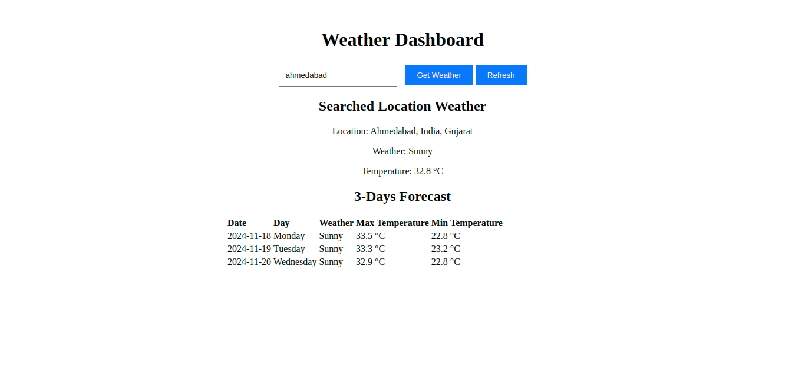

# functional-weather

This project uses the Weather API to fetch weather data.

## API Details
- **Used API**: [WeatherAPI](https://www.weatherapi.com/)
- **API Key**: `efe9ef18e4d646eaab861441241211`

## How to Run the Project

1. Open the project folder in **VS Code** (Visual Studio Code).
2. Install the **Live Server** extension if not already installed.
3. Start the server by right-clicking on the `index.html` (or main HTML file) and selecting **Open with Live Server**.
4. The project will open in your default browser. Check the page to see the weather data.

## Working Screenshot

## Prerequisites

- Install [VS Code](https://code.visualstudio.com/).
- Install the **Live Server** extension from the Extensions Marketplace in VS Code.
